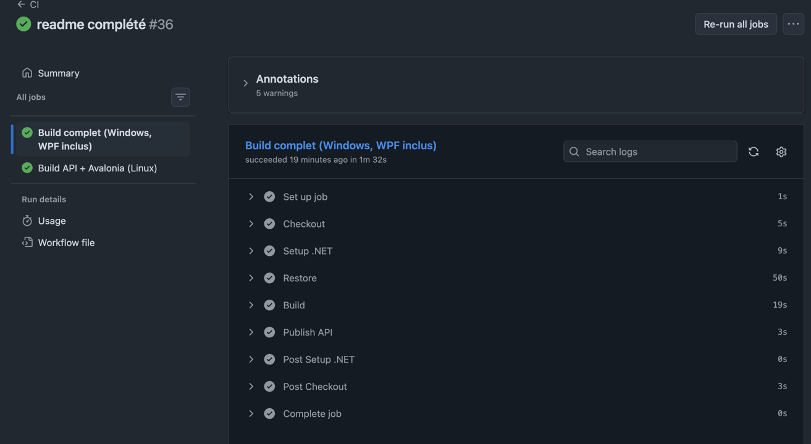

# ProjectPilot Lite

ProjectPilot Lite est un outil interne de gestion de projets techniques permettant de suivre les projets, tâches et livrables associés.

L'application repose sur une architecture client/serveur : une API REST ASP.NET Core, un client WPF basé sur le pattern MVVM et une base de données locale SQLite.

Prérequis  :

- SDK .NET 10
- Windows (obligatoire pour le client WPF)
- Git

Vérifier la version du SDK installé :

```bash
dotnet --version
# Version attendue : 10.0.x
```

Structure du projet : 

| Composant | Rôle |
|---|---|
| `ProjectPilotLite.Api` | API REST ASP.NET Core : contrôleurs, Entity Framework Core, migrations et accès aux données SQLite. |
| `ProjectPilotLite.Core` | Couche métier : entités principales (`Project`, `ProjectTask`, `Deliverable`), enums et DTOs partagés. |
| `ProjectPilotLite.Client.Shared` | Bibliothèque partagée : ViewModels MVVM et services clients communs (`ApiClient`). |
| `ProjectPilotLite.Wpf` | Application cliente Windows WPF (MVVM) consommant l'API REST. |
| `ProjectPilotLite.Avalonia` | Client alternatif Avalonia (approche cross-plateforme, fonctionnalité complémentaire). |
| `.github/workflows/ci.yml` | Pipeline d'intégration continue GitHub Actions vérifiant la compilation du projet. |

## Lancer l'API

Depuis la racine du projet :

```bash
dotnet run --project ProjectPilotLite.Api
```

- API accessible à l'adresse : `http://localhost:5123`
- Swagger (en environnement Development) : `http://localhost:5123/swagger`

Au démarrage :

- la base SQLite `projectpilot.db` est créée automatiquement si nécessaire ;
- les migrations Entity Framework Core sont appliquées automatiquement ;
- les données deviennent accessibles via les endpoints REST.

Lancer le client WPF : 

Depuis la racine du projet :

```bash
dotnet run --project ProjectPilotLite.Wpf
```

La configuration de l'API se trouve dans `ProjectPilotLite.Wpf/appsettings.json` :

```json
{
  "ApiBaseUrl": "http://localhost:5123"
}
```

> Attention, l'API doit être démarrée avant le lancement du client WPF si vous êtes sur Windows et avant le lancement Avalonia si vous êtes sur MacOS.

Fonctionnalités réalisées : 
- Affichage de la liste des projets.
- Consultation du détail d'un projet.
- Création d'un projet.
- Modification du statut d'un projet.

  Gestion des tâches : 
- Affichage des tâches associées à un projet.
- Création de tâches.
- Modification du statut des tâches.

  Gestion des livrables
- Affichage des livrables d'un projet.
- Création de livrables.
- Validation ou refus d'un livrable.
- Ajout d'un commentaire lors du traitement.

  Tableau de bord et indicateurs de suivi :
- nombre total de projets ;
- nombre de projets en cours ;
- nombre de projets bloqués ;
- nombre total de tâches ;
- nombre de tâches terminées ;
- nombre de livrables déposés.

Éléments non terminés / limites : 

Certaines fonctionnalités restent volontairement hors périmètre de cette version :

- absence d'authentification utilisateur ;
- absence de gestion des rôles et permissions ;
- absence de téléversement réel de fichiers pour les livrables ;
- client Avalonia encore partiel (extension cross-plateforme complémentaire) ;
- certaines améliorations ergonomiques pourraient être ajoutées côté interface.

Ces limites n'empêchent pas l'utilisation principale de l'application pour le suivi interne de projets techniques.

Intégration continue : 

Le projet utilise **GitHub Actions** pour automatiser la vérification du code. Le workflow est défini dans `.github/workflows/ci.yml` et réalise :

- la restauration des dépendances NuGet ;
- la compilation des différents projets ;
- la vérification de la compatibilité de l'API et des clients (Windows + Linux).

Le pipeline détecte automatiquement les erreurs de compilation avant intégration sur la branche principale.

_Une capture d'écran d'un pipeline réussi est jointe au livrable final conformément aux consignes du projet._
